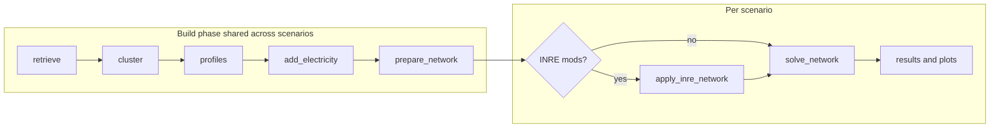

# INRE — Germany Electricity Grid Simulations

This document is the **single reference** for the INRE project layer on top of [PyPSA-Eur](https://github.com/PyPSA/pypsa-eur). It describes the plan, all file locations, configuration choices (dates, resolution, clustering), scenarios, Dunkelflaute stress testing, new nuclear technologies, and how to run and compare results.

**Target runtime:** each single scenario solve should complete in **≤ 15 minutes** on a laptop (10 clusters, 2-week snapshots at 3-hour resolution, HiGHS solver).

---

## 1. Project goal

Simulate the **Germany electricity grid only** to study how **new nuclear power plant types** can be combined with **renewable generation** during **Dunkelflaute** events (extended periods of low wind and solar availability).

The workflow supports:

1. **Base case** — Germany grid with up-to-date free data sources, normal weather profiles, no new nuclear build.
2. **Dunkelflaute scenarios** — deliberate reduction of wind/solar availability profiles.
3. **Nuclear technology scenarios** — extendable SMR, MSR, or LFR at candidate sites under Dunkelflaute stress.
4. **Cross-scenario comparison** — production mix, system cost, CO₂, installed capacity, total investment.

---

## 2. Key design decisions

| Setting | Current value (Phase 2) | Rationale |
|---------|-------------------------|-----------|
| Country | `DE` (Germany only) | Focused national study |
| Model type | Electricity-only | No sector coupling (heat, transport, etc.) |
| Planning horizon | **2050** | Technology costs from PyPSA technology-data |
| Spatial clustering | **10 nodes** | Balance between accuracy and runtime |
| Snapshot window | **2021-01-25 → 2021-02-08** | 2-week Jan 2021 winter Dunkelflaute period |
| Temporal resolution | **3-hour** (`resolution_elec: 3h`) | ~112 snapshots over 2 weeks; keeps solve ≤ 15 min |
| Weather cutout | `europe-2021-sarah3-era5` | Full-year 2021 archive cutout (~6 GB from `data.pypsa.org`) |
| `tutorial` | `false` | Required for full cutout and data retrieve |
| Solver | **HiGHS** | Free; no Gurobi license required |
| Renewable capacity year | **2024** | powerplantmatching estimate |
| CO₂ cap | `500e+6` t | Policy placeholder; tune in config |
| Dunkelflaute stress | `auto_worst_days: 5` | Auto-picks 5 lowest VRE days inside the simulation window |

### Phase 1 fast-dev (optional)

For quick pipeline smoke tests without the 6 GB download, use [`config/inre/config.phase1-fast.yaml`](config/inre/config.phase1-fast.yaml) (March 2013, 1 week, ~140 MB cutout, hourly).

### Germany-specific note

Operating nuclear plants in Germany are shut down. The **base case has no existing nuclear generation**. Fossil, hydro, and renewables reflect the filtered powerplant database. New reactors appear only in nuclear scenarios via `inre.nuclear.extendable_carriers`.

---

## 3. Workflow architecture

```
retrieve data → cluster DE grid → renewable profiles
    → add_electricity → prepare_network
        → [INRE: apply_inre_network] → solve_network
            → plot_statistics / compare_scenarios
```

The INRE step runs **between** `prepare_network` and `solve_network` when Dunkelflaute stress and/or new nuclear carriers are enabled:



**`apply_inre_network`** (`scripts/inre/apply_inre_network.py`) chains:

- `apply_dunkelflaute.py` — multiplies wind/solar `generators_t.p_max_pu`
- `add_nuclear_technologies.py` — adds extendable generators at candidate sites

Snakemake wiring: [`rules/inre.smk`](rules/inre.smk), included from [`Snakefile`](Snakefile) line 87.

---

## 4. Repository changes (INRE layer)

All INRE-specific additions live in dedicated paths; the core PyPSA-Eur workflow is unchanged except for one `Snakefile` include.

### 4.1 New and modified files

| Path | Type | Description |
|------|------|-------------|
| [`config/inre/config.base.yaml`](config/inre/config.base.yaml) | Config | Phase 2 base case (Jan 2021 winter window) |
| [`config/inre/config.scenarios.yaml`](config/inre/config.scenarios.yaml) | Config | Multi-scenario driver (`run.name: all`, shared resources) |
| [`config/inre/config.phase1-fast.yaml`](config/inre/config.phase1-fast.yaml) | Config | Phase 1 fast-dev (March 2013, optional) |
| [`config/inre/scenarios.yaml`](config/inre/scenarios.yaml) | Config | Per-scenario overrides |
| [`data/inre/dunkelflaute.yaml`](data/inre/dunkelflaute.yaml) | Data | Phase 2 Dunkelflaute stress parameters |
| [`data/inre/dunkelflaute.phase1.yaml`](data/inre/dunkelflaute.phase1.yaml) | Data | Phase 1 Dunkelflaute parameters |
| [`data/inre/custom_costs_nuclear.csv`](data/inre/custom_costs_nuclear.csv) | Data | SMR / MSR / LFR cost placeholders |
| [`data/inre/custom_powerplants_nuclear_DE.csv`](data/inre/custom_powerplants_nuclear_DE.csv) | Data | Zero-capacity candidate reactor sites |
| [`scripts/inre/apply_dunkelflaute.py`](scripts/inre/apply_dunkelflaute.py) | Script | VRE profile derating logic |
| [`scripts/inre/add_nuclear_technologies.py`](scripts/inre/add_nuclear_technologies.py) | Script | Add extendable nuclear generators |
| [`scripts/inre/apply_inre_network.py`](scripts/inre/apply_inre_network.py) | Script | Snakemake entry point for INRE mods |
| [`scripts/inre/compare_scenarios.py`](scripts/inre/compare_scenarios.py) | Script | Cross-scenario KPI tables and charts |
| [`scripts/inre/__init__.py`](scripts/inre/__init__.py) | Package | Python package marker |
| [`rules/inre.smk`](rules/inre.smk) | Snakemake | `apply_inre_network` rule; `solve_network` input routing |
| [`Snakefile`](Snakefile) | Snakemake | Added `include: "rules/inre.smk"` |
| [`INRE-README.md`](INRE-README.md) | Docs | This file |

### 4.2 Output directories (after runs)

With multi-scenario mode (`config.scenarios.yaml`), results use the **scenario key** as the folder name:

| Path | Contents |
|------|----------|
| `results/base/` | Base scenario (normal VRE profiles) |
| `results/dunkelflaute/` | Dunkelflaute stress only |
| `results/dunkelflaute-smr/` | Dunkelflaute + SMR |
| `results/dunkelflaute-msr/` | Dunkelflaute + MSR |
| `results/dunkelflaute-lfr/` | Dunkelflaute + LFR |
| `results/inre-comparison/` | Comparison CSV/XLSX and PNG charts |
| `resources/` | Shared intermediate networks (`shared_resources.policy: true`) |
| `cutouts/europe-2021-sarah3-era5.nc` | Full-year 2021 weather cutout (~6 GB, downloaded once) |

Single run without multi-scenario (`config.base.yaml` only, `run.name: inre-de-base`):

```
results/inre-de-base/networks/base_s_10_elec_.nc
```

INRE-modified intermediate network (before solve):

```
resources/<run>/networks/base_s_10_elec__inre.nc
```

---

## 5. Configuration reference

### 5.1 Base case — `config/inre/config.base.yaml`

```yaml
run:
  name: "inre-de-base"

countries: [DE]

scenario:
  clusters: [10]
  opts: [""]

snapshots:
  start: "2021-01-25"
  end: "2021-02-08"

costs:
  year: 2050
  custom_cost_fn: data/inre/custom_costs_nuclear.csv

clustering:
  temporal:
    resolution_elec: 3h

atlite:
  default_cutout: europe-2021-sarah3-era5
  cutouts:
    europe-2021-sarah3-era5:
      time: ["2021", "2021"]

tutorial: false

inre:
  enabled: true
  dunkelflaute:
    enabled: false
  nuclear:
    extendable_carriers: []
```

**Extendable generators (base):** solar, solar-hsat, onwind, offwind-ac, offwind-dc, offwind-float, OCGT, CCGT, battery, H2 — **not** nuclear.

### 5.2 Multi-scenario — `config/inre/config.scenarios.yaml`

Use **together** with `config.base.yaml`:

```bash
snakemake -call solve_elec_networks \
  --configfile config/inre/config.base.yaml \
  --configfile config/inre/config.scenarios.yaml
```

Key settings:

- `run.name: all` — runs every scenario in `config/inre/scenarios.yaml`
- `run.shared_resources.policy: true` — build phase shared across scenarios

### 5.3 INRE config block (`inre:`)

| Key | Description |
|-----|-------------|
| `inre.enabled` | Master switch for INRE pipeline |
| `inre.dunkelflaute.enabled` | Apply VRE stress before solve |
| `inre.dunkelflaute.config` | Path to `data/inre/dunkelflaute.yaml` |
| `inre.nuclear.extendable_carriers` | List of new nuclear carrier names, e.g. `[nuclear-smr]` |
| `inre.nuclear.sites_file` | Candidate sites CSV |
| `inre.nuclear.p_nom_max_per_site` | Max build per site (MW), default `1500` |

---

## 6. Scenario matrix

Defined in [`config/inre/scenarios.yaml`](config/inre/scenarios.yaml):

| Scenario ID | VRE stress | New nuclear | Results folder | Purpose |
|-------------|-----------|-------------|----------------|---------|
| `base` | Off | None | `results/base/` | Normal winter profiles; reference fleet |
| `dunkelflaute` | On (15% wind, 10% solar) | None | `results/dunkelflaute/` | Quantify gap during Dunkelflaute |
| `dunkelflaute-smr` | On | `nuclear-smr` | `results/dunkelflaute-smr/` | Small modular reactor contribution |
| `dunkelflaute-msr` | On | `nuclear-msr` | `results/dunkelflaute-msr/` | Molten salt reactor contribution |
| `dunkelflaute-lfr` | On | `nuclear-lfr` | `results/dunkelflaute-lfr/` | Lead-cooled fast reactor contribution |

Nuclear scenarios also set:

- `costs.custom_cost_fn: data/inre/custom_costs_nuclear.csv`
- `pypsa_eur.Generator` — adds the new carrier so PyPSA-Eur keeps the component

---

## 7. Dunkelflaute implementation

PyPSA-Eur has **no built-in Dunkelflaute logic**. INRE derates renewable availability by modifying `n.generators_t.p_max_pu` before the solve step.

### 7.1 Parameters — `data/inre/dunkelflaute.yaml`

| Parameter | Value (Phase 2) | Meaning |
|-----------|-----------------|---------|
| `wind_factor` | `0.15` | Retain 15% of wind availability during stress window |
| `solar_factor` | `0.10` | Retain 10% of solar availability during stress window |
| `auto_worst_days` | `5` | Auto-pick 5 lowest national VRE days inside the simulation window |
| `time_start` | `2021-01-28` | Fallback fixed window start (ignored when `auto_worst_days` is set) |
| `time_end` | `2021-02-03` | Fallback fixed window end |
| `ramp_hours` | `6` | Smooth transition at stress window edges |
| `carriers.wind` | onwind, offwind-* | Wind carriers affected |
| `carriers.solar` | solar, solar-hsat | Solar carriers affected |

### 7.2 How it works (`scripts/inre/apply_dunkelflaute.py`)

1. Build a time mask (fixed calendar window or auto worst-VRE days).
2. For each affected generator, scale `p_max_pu` by `wind_factor` or `solar_factor`.
3. Optional edge ramping over `ramp_hours` snapshots.

---

## 8. New nuclear technologies

Each reactor type is a separate PyPSA **carrier**. One primary new technology per scenario keeps results interpretable.

### 8.1 Required data per technology

| # | Data item | Unit | Typical source | Where to implement |
|---|-----------|------|----------------|-------------------|
| 1 | Carrier name | — | Your taxonomy | `inre.nuclear.extendable_carriers`, `pypsa_eur.Generator` |
| 2 | Investment cost | EUR/kW | literature / technology-data | `custom_costs_nuclear.csv` → `investment` |
| 3 | Fixed O&M (FOM) | %/year | literature | `custom_costs_nuclear.csv` → `FOM` |
| 4 | Variable O&M (VOM) | EUR/MWh | literature | `custom_costs_nuclear.csv` → `VOM` |
| 5 | Fuel cost | EUR/MWh_th | uranium markets | `custom_costs_nuclear.csv` → `fuel` |
| 6 | Efficiency | p.u. (0.33–0.37) | design | `custom_costs_nuclear.csv` → `efficiency` |
| 7 | Lifetime | years | design | `custom_costs_nuclear.csv` → `lifetime` |
| 8 | CO₂ intensity | t/MWh | ~0 for nuclear | `custom_costs_nuclear.csv` → `CO2 intensity` |
| 9 | Availability factor | p.u. (0.85–0.95) | design / IAEA | `inre.nuclear.p_max_pu` or script default `0.9` |
| 10 | Ramp limit | p.u./hour | design | `add_nuclear_technologies.py` (`0.5`) |
| 11 | Minimum stable load | p.u. | design | `add_nuclear_technologies.py` (`0.3`) |
| 12 | Siting (lat/lon) | degrees | policy / former sites | `custom_powerplants_nuclear_DE.csv` |
| 13 | Max build per site | MW | policy | `inre.nuclear.p_nom_max_per_site` |
| 14 | National build cap | GW | policy | Future: `GlobalConstraint` in script |
| 15 | Commissioning year | year | policy | `DateIn` in sites CSV |
| 16 | Plot colour | — | — | `config/plotting.default.yaml` `tech_colors` |

**Important:** values in `data/inre/custom_costs_nuclear.csv` are **placeholders** (`INRE assumption`). Replace with cited literature before publication.

### 8.2 Placeholder costs (2050)

| Carrier | Investment (EUR/kW) | Efficiency | Lifetime (y) |
|---------|---------------------|------------|--------------|
| `nuclear-smr` | 4500 | 0.33 | 60 |
| `nuclear-msr` | 5200 | 0.35 | 50 |
| `nuclear-lfr` | 4800 | 0.34 | 55 |

### 8.3 Candidate sites — `data/inre/custom_powerplants_nuclear_DE.csv`

Zero-capacity rows at former German nuclear locations (Grohnde, Brokdorf, Isar, Emsland, Neckarwestheim). The script maps each site to the nearest network bus and adds an extendable generator.

---

## 9. Free data sources

| Data | Config knob | Source |
|------|-------------|--------|
| Transmission grid | default OSM base network | OpenStreetMap via PyPSA archive |
| Power plants | `electricity.powerplants_filter` | [powerplantmatching](https://github.com/PyPSA/powerplantmatching) |
| Renewable capacities | `estimate_renewable_capacities.year: 2024` | powerplantmatching |
| Electricity demand | auto-retrieved | ENTSO-E Transparency Platform |
| Weather profiles | `atlite.cutouts` | ERA5 + SARAH-3 (`data.pypsa.org`) |
| Technology costs | `costs.year: 2050` | [PyPSA technology-data](https://github.com/PyPSA/technology-data) |
| Nuclear availability (legacy) | `conventional.nuclear.p_max_pu` | IAEA PRIS via `data/nuclear_p_max_pu.csv` |

First run downloads the tutorial bundle and the March 2013 cutout (~hundreds of MB). **No Copernicus CDS account required** for Phase 1.

---

## 10. Setup and commands

### 10.1 Environment

```bash
cd /path/to/INRE-Project-PyPSA-EUR
pixi install
pixi shell
```

### 10.2 Base case only

```bash
snakemake -call solve_elec_networks \
  --configfile config/inre/config.base.yaml
```

### 10.3 All INRE scenarios

```bash
snakemake -call solve_elec_networks \
  --configfile config/inre/config.base.yaml \
  --configfile config/inre/config.scenarios.yaml
```

### 10.4 Per-scenario statistics plot

```bash
snakemake -call results/inre-de-base/figures/statistics_supply_bar_base_s_10_elec_.pdf \
  --configfile config/inre/config.base.yaml
```

### 10.5 Interactive dashboard (optional)

```bash
python scripts/export_results_dashboard.py \
  --network results/inre-de-base/networks/base_s_10_elec_.nc \
  --output-dir results/inre-de-base/dashboard
```

### 10.6 Cross-scenario comparison

After all solves complete:

```bash
python scripts/inre/compare_scenarios.py --output-dir results/inre-comparison
```

Default scenario list:

- `base:inre-de-base`
- `dunkelflaute:inre-de-dunkelflaute`
- `dunkelflaute-smr:inre-de-df-smr`
- `dunkelflaute-msr:inre-de-df-msr`
- `dunkelflaute-lfr:inre-de-df-lfr`

---

## 11. Results and KPIs

### 11.1 Built-in PyPSA-Eur plots (per scenario)

After solve, electricity-only statistics are available via `plot_base_statistics`:

- Installed vs optimal capacity
- Supply (production mix)
- CAPEX / OPEX
- Curtailment

### 11.2 Comparison outputs (`results/inre-comparison/`)

| File | Content |
|------|---------|
| `comparison_table.csv` / `.xlsx` | Summary KPIs per scenario |
| `production_mix.png` | Stacked supply by carrier (TWh) |
| `capacity.png` | Optimal capacity by carrier (GW) |
| `costs_breakdown.png` | CAPEX and OPEX (bn EUR) |
| `co2_emissions.png` | CO₂ emissions (Mt) |

| KPI | PyPSA method |
|-----|--------------|
| Production mix | `n.statistics.supply()` by carrier |
| System cost | `n.statistics.capex()` + `n.statistics.opex()` |
| CO₂ emissions | generation × `co2_emissions` × snapshot weighting |
| Installed capacity | `n.statistics.optimal_capacity()` |
| Total investment | `n.statistics.capex()` |
| Objective value | `n.objective` |

---

## 12. Temporal resolution and runtime

### 12.1 Current settings (Phase 2)

| Parameter | Value | Snapshots (2-week window) |
|-----------|-------|--------------------------|
| `resolution_elec: false` | Hourly | 336 |
| `resolution_elec: 3h` | 3-hour blocks | **112 (current)** |
| `resolution_elec: 24h` | Daily average | 14 |

### 12.2 Expected runtime

| Phase | Duration |
|-------|----------|
| First full build + 6 GB cutout download | 30–90 min (network-dependent) |
| Subsequent solves (10 clusters, 3h, 2 weeks) | 5–15 min each |

### 12.3 If solve exceeds 15 minutes

1. Set `clustering.temporal.resolution_elec: 24h` in config.
2. Reduce `scenario.clusters` to `[8]`.
3. Remove `solar-hsat` and `offwind-float` from `renewable_carriers`.

---

## 13. Phase 2 — winter Dunkelflaute (active)

Phase 2 is **implemented** in `config.base.yaml` and `config.scenarios.yaml`:

| Item | Value |
|------|-------|
| Snapshot window | `2021-01-25` → `2021-02-08` (14 days) |
| Weather cutout | `europe-2021-sarah3-era5` (full year 2021, ~6 GB) |
| Cutout config | `time: ["2021", "2021"]` |
| Dunkelflaute stress | `auto_worst_days: 5` in `data/inre/dunkelflaute.yaml` |
| Temporal resolution | `3h` (runtime target ≤ 15 min per solve) |
| `tutorial` | `false` |

**First run** downloads the full 2021 cutout to `cutouts/europe-2021-sarah3-era5.nc`. Ensure ~10 GB free disk space.

### Phase 1 fast-dev (archived config)

For quick tests without the large download:

```bash
snakemake -call solve_elec_networks --configfile config/inre/config.phase1-fast.yaml
```

Uses March 2013 (`europe-2013-03-sarah3-era5`, ~140 MB) and [`data/inre/dunkelflaute.phase1.yaml`](data/inre/dunkelflaute.phase1.yaml).

### Alternative winter events

| Event | Snapshot window | Cutout |
|-------|-----------------|--------|
| Jan 2021 Dunkelflaute **(current)** | `2021-01-25` → `2021-02-08` | `europe-2021-sarah3-era5` |
| Dec 2016 | `2016-12-05` → `2016-12-18` | `europe-2016` (build via CDS) |

---

## 14. Adding a new scenario

1. Add an entry to [`config/inre/scenarios.yaml`](config/inre/scenarios.yaml) with `run.name`, `inre`, and optional `costs` / `pypsa_eur` overrides.
2. Add cost rows to [`data/inre/custom_costs_nuclear.csv`](data/inre/custom_costs_nuclear.csv) for new carriers.
3. Add site rows to [`data/inre/custom_powerplants_nuclear_DE.csv`](data/inre/custom_powerplants_nuclear_DE.csv) if needed.
4. Register the scenario in `compare_scenarios.py` `--scenarios` list (or pass via CLI).

---

## 15. Troubleshooting

| Issue | Likely fix |
|-------|------------|
| `pixi: command not found` | Install [pixi](https://pixi.sh) or use the conda environment from `envs/` |
| Solve too slow | `resolution_elec: 24h` or fewer clusters |
| Nuclear carrier not in costs | Add rows to `custom_costs_nuclear.csv`; set `costs.custom_cost_fn` in scenario |
| Carrier dropped from network | Add carrier to `pypsa_eur.Generator` in scenario config |
| `compare_scenarios.py` finds no networks | Run `solve_elec_networks` first; check `results/base/`, `results/dunkelflaute/`, etc. |
| Large cutout download fails | Ensure ~10 GB disk space; retry `snakemake -call cutouts/europe-2021-sarah3-era5.nc` |
| Config validation error on `inre:` block | Schema allows extra fields; ensure YAML indentation is correct |

---

## 16. Further reading

- [PyPSA-Eur documentation](https://pypsa-eur.readthedocs.io/)
- [PyPSA-Eur weather cutouts](https://pypsa-eur.readthedocs.io/en/latest/data-cutouts.html)
- [Germany electricity example](../config/examples/config.germany-electricity.yaml) — upstream template for this project
- Main repository README: [`README.md`](README.md)

---

## 17. Implementation checklist

| Step | Status | Item |
|------|--------|------|
| 1 | Done | `config/inre/config.base.yaml` — Germany base case |
| 2 | Done | `scripts/inre/apply_dunkelflaute.py` + `data/inre/dunkelflaute.yaml` |
| 3 | Done | `rules/inre.smk` + `Snakefile` include |
| 4 | Done | `config/inre/scenarios.yaml` + `config.scenarios.yaml` — 5 scenarios |
| 5 | Done | `data/inre/custom_costs_nuclear.csv` + `custom_powerplants_nuclear_DE.csv` |
| 6 | Done | Nuclear scenarios: SMR, MSR, LFR |
| 7 | Done | `scripts/inre/compare_scenarios.py` |
| 8 | Done | Phase 2: Jan 2021 winter window + `europe-2021-sarah3-era5` full-year cutout |
