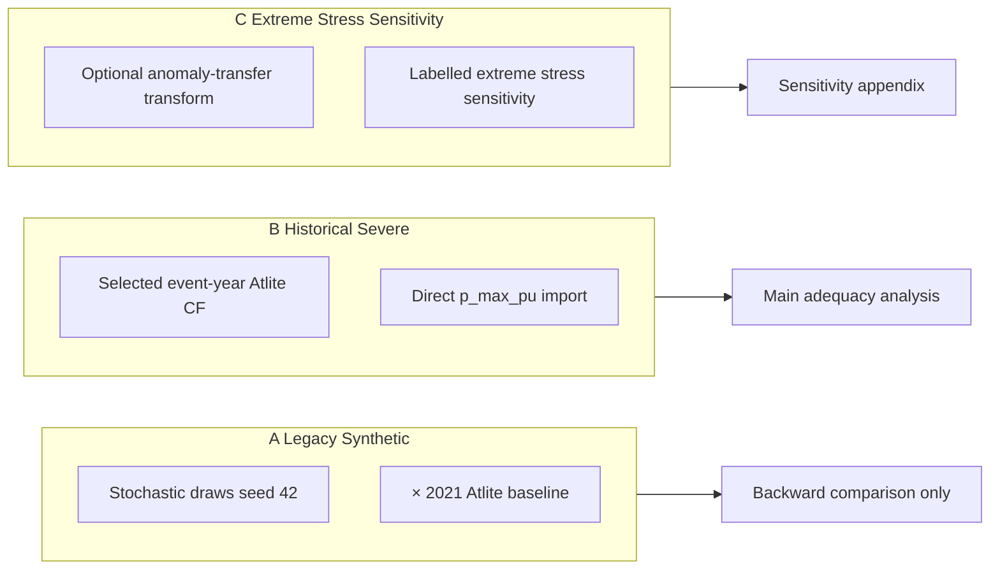

# MODEL_UPDATE_PLAN_V3 (Revize) — INRE Model Doğrulama ve Şiddetli Dunkelflaute Tasarımı

**Durum:** Planlama aşaması — proje dosyası düzenlenmedi, PyPSA-Eur/GAMSPy/Atlite/Snakemake çalıştırılmadı, mevcut profiller ve sonuçlar korunacak.

**Revizyon özeti:** Önceki plandaki hatalar düzeltildi: (i) yüksek artık yük terminolojisi, (ii) üç ayrı stres senaryo tipi, (iii) tarihsel ana senaryoda doğrudan CF importu (oran yöntemi değil), (iv) tarihsel profilde yapay edge ramp yok, (v) cluster×carrier mekânsal profiller, (vi) sabit kapasite karışımı ile çok yıllı ranking, (vii) matched-reference senaryosu, (viii) geliştirilmiş olay seçim iş akışı, (ix) net şiddet tanımları, (x) nükleer eşit-site tasarımı, (xi) reaktör teknolojisi operasyonel denetimi, (xii) CO₂ birim doğrulaması zorunlu, (xiii) iletim dondurma açık spesifikasyon.

**Onay sonrası teslim:** [`MODEL_UPDATE_PLAN_V3.md`](MODEL_UPDATE_PLAN_V3.md)

---

## Adım 1 — Mevcut Uygulamanın Denetimi

### 1.1 Konfigürasyon ve senaryo mirası

| Dosya | Rol |
|---|---|
| [`config/inre/config.base.yaml`](config/inre/config.base.yaml) | DE, 10 cluster, 3h, 2021-01-25→2021-02-08, CO₂ 50 Mt/y |
| [`config/inre/scenarios.yaml`](config/inre/scenarios.yaml) | 10 senaryo override |
| [`data/inre/dunkelflaute.yaml`](data/inre/dunkelflaute.yaml) | Legacy sentetik profil parametreleri |

**Mevcut 10 senaryo:** `base`, `base-fixedcap`, `dunkelflaute`, `dunkelflaute-fixedcap`, `dunkelflaute-{smr,msr,lfr}`, `dunkelflaute-smr-capex{70,85,115}`.

### 1.2 Legacy sentetik Dunkelflaute — mevcut formülasyon

**Tanım (düzeltilmiş terminoloji):** *a synthetic low-renewable profile generated using parameterised stochastic draws with a fixed random seed* — notebook parametreleri literatürden esinlenmiş olsa da her parametre tek tek referansa bağlanmadıkça **"literature-calibrated" denmeyecek**.

**Kaynak:** [`dunkenflaute_capacity_factor_calculations.ipynb`](dunkenflaute_capacity_factor_calculations.ipynb) → `output/dunkelflaute/*_factors.csv` → [`scripts/inre/apply_dunkelflaute.py`](scripts/inre/apply_dunkelflaute.py).

| Özellik | Mevcut değer |
|---|---|
| Olay tarihleri | 2021-01-25 → 2021-02-07 |
| Süre | 14 gün (112 × 3h) |
| Veri doğası | Sentetik (seed 42) × Atlite 2021 baseline |
| Wind factor (stress içi) | min 0.103, max 0.370, mean 0.177 |
| Solar factor (stress içi) | min 0.000, max 1.000, mean 0.509 |
| Mekânsal işlem | Ulusal uniform çarpan (tüm jeneratörlere aynı) |
| Edge ramp | `ramp_hours: 6` — **bug:** PyPSA'da snapshot sayısı olarak yorumlanıyor (18h), saat değil |

**Legacy uygulama denklemi** (yalnızca sentetik senaryo için geçerli):

\[
m_{k,t} = 1 - w_t\left(1 - f^{syn}_{k,t}\right), \quad \bar{p}^{DF}_{g,t} = \bar{p}^{Base}_{g,t} \cdot m_{k,t}
\]

**Düzeltme (legacy):** `ramp_hours` **saat** olarak yorumlanmalı → 3h snapshot'ta `ramp_steps = ramp_hours / 3`. [`apply_dunkelflaute.py`](scripts/inre/apply_dunkelflaute.py) ve [`gamspy-de/src/apply_scenario.py`](gamspy-de/src/apply_scenario.py) hizalanmalı.

### 1.3 Doğrulanmış model sorunları (v2 sonuçları)

| Sorun | Kanıt |
|---|---|
| Phantom VRE | 488 GW wind, 916 GW solar (`capacity_gw.csv`) |
| Phantom link-battery | 414 GW (`RESULTS_FINAL.md`) |
| Solar artefaktı | 0.70 → 3.78 TWh |
| Eşitsiz nükleer | SMR 7.5 GW vs MSR/LFR 4.5 GW |
| CO₂ birimi belirsiz | `CCGT.CO2 intensity = gas.CO2 intensity = 0.198` (yakıt bazlı?); verimlilik ayrımı doğrulanmadı |
| İletim genişlemesi | `transmission_limit: vopt` → `s_nom_extendable=True` |

---

## Adım 2 — Üç Ayrı Stres Senaryo Tipi

Plan artık **üç farklı stres tipini** kesin olarak ayırır:

### A. Legacy synthetic Dunkelflaute

- **Amaç:** Önceki raporla geriye dönük karşılaştırma.
- **Yöntem:** Mevcut notebook + `data/inre/dunkelflaute.yaml` — **değiştirilmez**, üzerine yazılmaz.
- **Uygulama:** Mevcut `apply_dunkelflaute.py` çarpan mantığı; `ramp_hours` saat olarak düzeltilir.
- **Ana analizde kullanılmaz.**

### B. Historical severe Dunkelflaute (ana kanıta dayalı senaryo)

- **Amaç:** Ana yeterlilik stres testi.
- **Yöntem:** Seçilen olay yılının gerçek Atlite kapasite faktörlerini **doğrudan** `p_max_pu` olarak atamak:

\[
\bar{p}^{Historical}_{n,k,t} = CF^{event}_{n,k,t}
\]

- **Yapılmayacak:** 2021 baseline × tarihsel/oran çarpanı.
- **Yapılmayacak:** Yapay lineer edge ramp.
- **Snapshot:** Seçilen 14 günlük olay + **3–7 gün önce ve 3–7 gün sonra** tarihsel buffer (tercihen ±7 gün → toplam ~28 gün); doğal giriş/dalgalanma/çıkış korunur.
- **Mekânsal:** Cluster × carrier × timestamp (bkz. Bölüm 5).

### C. Extreme stress sensitivity (ayrı duyarlılık)

- **Amaç:** Tarihsel olaydan türetilmiş, açıkça belgelenmiş dönüşüm ile ekstrem stres.
- **Etiket:** `extreme stress sensitivity` — **asla** `historical event` olarak adlandırılmaz.
- **İsteğe bağlı oran yöntemi** (yalnızca bu duyarlılık için):

\[
f^{hist}_{k,t} = \frac{CF^{event}_{k,t}}{CF^{reference}_{k,t}}
\]

Ayrıca belgelenmesi gerekenler:
- `reference` profili tanımı (ör. çok yıllı medyan, aynı doy/saat)
- payda eşiği \(\epsilon\)
- \(f > 1\) değerlerinin işlenmesi (clip yok — recovery dönemleri korunur)
- gece güneş işlemi
- bu dönüşümün neden gerekli olduğu

---

## Adım 3 — Olay Seçimi: Metrik, Kapasite, Talep

### 3.1 Terminoloji düzeltmesi

Dunkelflaute, sistem yeterliliği açısından **yüksek artık yük** ile ilişkilidir:

\[
RL_t = D_t - W_t - S_t
\]

Kullanılacak ifadeler:
- **high-residual-load window**
- **high-residual-load scarcity event**

Kullanılmayacak: *low-residual-load window*.

### 3.2 Sabit teknoloji karışımı (çok yıllı ranking)

Her aday yıl için **aynı sabit kapasiteler** kullanılır; o yılın gerçek kurulu gücü değil:

\[
W_t = CF^{onwind}_t \, P^{fixed}_{onwind} + CF^{offwind}_t \, P^{fixed}_{offwind}
\]

\[
S_t = CF^{solar}_t \, P^{fixed}_{solar}
\]

**Önerilen kapasite tabanı:** PyPSA operasyonel modelindeki **2024 brownfield** kapasiteleri ([`config/inre/config.base.yaml`](config/inre/config.base.yaml) `estimate_renewable_capacities.year: 2024`; `credible_capacity.csv`: onwind+offwind ≈ 84.5 GW, solar ≈ 48.8 GW).

**Gerekçe:** Olay sıralaması meteoroloji ve talep yapısını yansıtmalı; tarihsel kurulum seviyelerinin yıllar arası farkı ranking'i kirletmemeli.

Offshore alt-carrier (`offwind-ac`, `offwind-dc`, `offwind-float`) ranking'de toplam offshore CF olarak birleştirilir; simülasyonda ayrı profiller korunur.

### 3.3 Olay seçim metriği (birincil)

\[
RL_t^{+} = \max(D_t - W_t - S_t,\ 0)
\]

\[
I_\tau = \frac{\sum_{t=\tau}^{\tau+H-1} RL_t^{+}}{\sum_{t=\tau}^{\tau+H-1} D_t}, \quad H = 336\ \text{hours}
\]

**Ek raporlama metrikleri** (otomatik seçimden önce):
- mean residual load
- maximum residual load
- cumulative residual energy \(\sum RL_t^{+}\)
- mean wind CF, mean solar CF
- minimum rolling combined VRE output
- duration below selected VRE thresholds (ör. Mockert et al. 2023: 48h ortalama birleşik CF < 0.06)

**Renewable drought index** (doğrulama, birincil seçim değil):

\[
DI_\tau = 1 - \frac{\sum_{t=\tau}^{\tau+H-1}(W_t+S_t)}{\sum_{t=\tau}^{\tau+H-1}D_t}
\]

### 3.4 Olay seçim iş akışı (zorunlu)

1. Tüm rolling 14-gün pencerelerini \(I_\tau\) ile sırala
2. En az **10 en şiddetli adayı** listele
3. Aynı olaydan gelen güçlü örtüşen pencereleri çıkar veya işaretle
4. Fiziksel plausibility incelemesi (mevsim, eşzamanlı düşük rüzgâr+güneş, talep profili)
5. Belgelenmiş kriterlerle nihai olay seçimi
6. **Tek metrikten otomatik seçim yapılmaz**

### 3.5 Şiddet tanımları (net ayrım)

| Senaryo tipi | Tanım |
|---|---|
| **Ana historical severe** | Seçilen veri setindeki **worst observed non-overlapping 14-day high-residual-load event** |
| **P95 sensitivity** | \(I_\tau\) > P95 eşiği (üst kuyruk — yüksek artık yük) |
| **P99 sensitivity** | \(I_\tau\) > P99 eşiği |
| **Worst observed sensitivity** | Mutlak maksimum \(I_\tau\) (örtüşen pencereler ayrı raporlanır) |

**Not:** P99 residual load = üst kuyruk; P1 renewable production = alt kuyruk — karıştırılmaz. Kesin tarih aralığı ve percentil değerleri **veri analizi sonrası** doldurulur.

### 3.6 Talep ve hava yılı tutarlılığı

**Değerlendirilen iki yaklaşım:**

| Yaklaşım | Hava | Talep |
|---|---|---|
| Historical event | Olay yılı | Olay yılı |
| Weather-only stress | Değişir | Sabit |

**Önerilen ana yaklaşım (hibrit, tutarlı):**

1. **Olay seçimi:** Olay yılı havası + olay yılı talebi + sabit \(P^{fixed}\) ile ranking
2. **Simülasyon çifti:** Matched reference ve historical severe **aynı talep serisini** kullanır (olay yılı talebi, gerekirse hedef sistem için normalizasyon ile)
3. **Karşılaştırma:** Severe event'i rastgele bir 2021 iki haftasına karşı **tek başına** koyma — yalnızca legacy geriye dönük karşılaştırma için 2021 `base` korunur

---

## Adım 4 — Matched-Reference Senaryosu

### 4.1 Yapı

Aynı şunları paylaşan eşleştirilmiş referans:

- tarihler veya mevsimsel konum
- talep serisi
- sabit üretim kapasiteleri
- iletim sistemi
- depolama sistemi

| Scenario | Demand | Renewable availability |
|---|---|---|
| `matched-reference` | Event demand | Multi-year median or representative normal profile |
| `historical-severe` | Same event demand | Actual historical event profile |
| `historical-severe + nuclear` | Same event demand | Actual historical event profile |

### 4.2 Etki tanımı

\[
\Delta X = X_{\mathrm{Historical\ Severe}} - X_{\mathrm{Matched\ Reference}}
\]

**Matched reference profili:** Seçilen olay penceresinin takvim konumu (doy/hour) için çok yıllı (2000–2021) **medyan CF** — cluster × carrier bazında; doğrudan `p_max_pu` ataması:

\[
\bar{p}^{Ref}_{n,k,t} = CF^{median}_{n,k,t}
\]

### 4.3 Geriye dönük 2021 base

Eski `base` (2021-01-25→02-08, normal Atlite) yalnızca önceki raporla karşılaştırma için korunur; ana ΔX analizinde kullanılmaz.

---

## Adım 5 — Mekânsal ve Teknoloji-Spesifik Profiller

### 5.1 Tercih edilen uygulama

Ulusal uniform çarpan **yalnızca basitleştirilmiş duyarlılık** olarak kalabilir; ana historical severe için:

\[
\bar{p}^{Historical}_{n,k,t} = CF^{event}_{n,k,t}
\]

- \(n\) = PyPSA cluster (10 bus)
- \(k\) ∈ {`onwind`, `offwind` (veya ac/dc/float ayrı), `solar`}
- \(t\) = timestamp

### 5.2 Carrier eşlemesi

| Atlite / profil | PyPSA carrier |
|---|---|
| onshore wind | `onwind` |
| offshore wind | `offwind-ac`, `offwind-dc`, `offwind-float` (cluster bazlı oranlarla veya ayrı CF) |
| utility PV | `solar` |
| single-axis tracking | `solar-hsat` |

**`solar` vs `solar-hsat`:** Atlite ayrı profil üretiyorsa **ayrı CSV**; aynı kaynaktan türetiliyorsa ortak profil + metadata'da gerekçe. Uygulama öncesi notebook'ta cluster başına her iki carrier için CF varlığı kontrol edilecek.

### 5.3 Yeni uygulama scripti

Mevcut `apply_dunkelflaute.py` çarpan mantığı legacy sentetik için kalır.

Yeni: `scripts/inre/apply_historical_dunkelflaute.py`
- Girdi: `data/inre/profiles/historical/{cluster}_{carrier}_cf.csv`
- İşlem: `generators_t.p_max_pu` **doğrudan overwrite** (çarpan yok, ramp yok)
- Config: `data/inre/dunkelflaute.historical.yaml`

---

## Adım 6 — Revize Senaryo Matrisi

### 6.1 Ana analiz seti (fixed-capacity operational stress)

| Scenario | Profile type | Demand | VRE availability | Nuclear | Purpose |
|---|---|---|---|---:|---|
| `legacy-2021-base` | Normal Atlite 2021 | 2021 | 2021 historical | 0 | Backward comparison |
| `legacy-synthetic-df` | A: Legacy synthetic | 2021 | Synthetic × baseline | 0 | Backward comparison |
| `matched-reference` | Matched ref | Event year | Multi-year median CF | 0 | Paired reference |
| `historical-severe` | B: Historical severe | Event year (same) | Event-year CF direct | 0 | **Main adequacy stress** |
| `historical-severe-gen-nuclear` | B | Event year (same) | Event-year CF | 4.5 GW equal-site | Nuclear contribution |
| `extreme-stress-sensitivity` | C: Anomaly transfer | Event year | Documented transform | 0 | Appendix sensitivity |

### 6.2 Nükleer teknoloji karşılaştırması

**Equal-capacity technology comparison** (aynı operasyonel koşullar):

| Parametre | Değer |
|---|---|
| Toplam kapasite | \(P^{nuclear} = 4.5\) GW |
| Siteler | **Grohnde, Brokdorf, Isar** (üç teknolojide ortak; [`custom_powerplants_nuclear_DE.csv`](data/inre/custom_powerplants_nuclear_DE.csv)) |
| Site başına | 1.5 GW |
| Bus, talep, VRE profili, fosil filo, iletim, depolama | Tüm SMR/MSR/LFR senaryolarında **özdeş** |

**Site-potential sensitivity** (saf teknoloji performans karşılaştırması **değil**):

| Technology | Max site potential |
|---|---:|
| SMR | 7.5 GW (5 site) |
| MSR | 4.5 GW (3 site) |
| LFR | 4.5 GW (3 site) |

### 6.3 Nükleer kapasite duyarlılığı (equal-site, generic advanced nuclear)

Ana operasyonel analizde tercih: **generic advanced nuclear** (bkz. Bölüm 7). Kapasite sweep:

| Level | GW |
|---|---:|
| nuc-0 | 0 |
| nuc-1.5 | 1.5 |
| nuc-3.0 | 3.0 |
| nuc-4.5 | 4.5 |
| nuc-7.5 | 7.5 |

SMR/MSR/LFR ayrı aileler yalnızca **maliyet/teknik duyarlılık** olarak.

### 6.4 İstatistiksel olay duyarlılıkları (ayrı)

- `historical-severe-p95`
- `historical-severe-p99`
- `historical-severe-worst` (örtüşme raporu ile)

---

## Adım 7 — Reaktör Teknolojileri Operasyonel Denetimi

### 7.1 Mevcut farklar ([`custom_costs_nuclear.csv`](data/inre/custom_costs_nuclear.csv), [`add_nuclear_technologies.py`](scripts/inre/add_nuclear_technologies.py), [`gamspy-de/inputs/technologies.csv`](gamspy-de/inputs/technologies.csv))

| Parametre | SMR | MSR | LFR | Kaynak |
|---|---:|---:|---:|---|
| efficiency | 0.33 | 0.35 | 0.34 | custom costs |
| marginal_cost (processed) | 12.09 | 10.64 | 11.44 | EUR/MWh |
| p_max_pu | 0.90 | 0.90 | 0.90 | code default |
| p_min_pu | 0.30 | 0.30 | 0.30 | code |
| ramp_limit | 0.50 | 0.50 | 0.50 | per snapshot (3h) |
| lifetime | 60 | 50 | 55 | yıl |
| CAPEX | farklı | farklı | farklı | — |
| outage / UC / startup | **Yok** | **Yok** | **Yok** | — |

**Sonuç:** Operasyonel parametreler neredeyse özdeş; farklar esas olarak verimlilik, marjinal maliyet ve CAPEX. Güçlü reaktör-teknolojisi operasyon karşılaştırması **desteklenmiyor**.

### 7.2 Önerilen yaklaşım

**Tercih edilen (basit):**
- Ana operasyonel yeterlilik analizi: tek **`generic-advanced-nuclear`** taşıyıcısı
- SMR, MSR, LFR: yalnızca maliyet ve teknik duyarlılık (CAPEX, efficiency, lifetime)

**Alternatif:** Ayrı aileler yalnızca izlenebilir kaynakla desteklenen operasyonel farklar eklenirse.

---

## Adım 8 — Model Düzeltmeleri

### 8.1 Düzeltme tablosu

| Issue | Current | Proposed correction | File | Expected effect | Re-run? |
|---|---|---|---|---|---|
| Phantom VRE | extendable, uncapped | Fixed-cap default; `extendable_carriers.Generator: []` | `config/inre/config.base.yaml`, `scenarios.yaml` | Phantom expansion kalkar | Yes |
| Phantom battery/H₂ | `Store: [battery,H2]` default | `Store: []`, `Link: []` | `config/inre/config.base.yaml` | Link-battery artefaktı kalkar | Yes |
| Transmission expansion | `transmission_limit: vopt` | `transmission_limit: v0` (bkz. 8.2) | `config/inre/config.base.yaml` | İletim donmuş | Yes |
| Load shedding / VOLL | disabled; 10k in script | `load_shedding.enable: true`, `default_cost: 100000` | `config.base.yaml`, `dispatch_fixed_solar.py` | Adequacy görünür | Yes |
| CO₂ accounting | Birim doğrulanmadı | Fiziksel test (8.3); düzeltme test sonucuna bağlı | `add_electricity.py`, `compare_scenarios.py`, GAMSPy | Doğru CO₂ | Yes |
| CAPEX/objective | Full annuity in objective | Raporlama: period OPEX birincil | `compare_scenarios.py` | Doğru maliyet başlığı | Partial |
| GAMSPy storage η | η² in SOC | Ayrı η_ch, η_dis | `build_model.py` | Doğru enerji bilançosu | Yes |
| PyPSA ramp @ 3h | 0.5 per snapshot | Saatlik ramp / 3 | `add_nuclear_technologies.py` | Gerçekçi ramp | Yes |
| Nuclear must-run | p_min_pu=0.3 | p_min_pu=0.0 | `add_nuclear_technologies.py`, GAMSPy tech CSV | Must-run kalkar | Yes |
| Unequal nuclear sites | SMR 5 site, MSR/LFR 3 | Equal: Grohnde+Brokdorf+Isar @ 1.5 GW | `add_nuclear_technologies.py`, sites filter | Adil karşılaştırma | Yes |
| Legacy ramp units | snapshots | hours / snapshot_hours | `apply_dunkelflaute.py` | Doğru 6h ramp | Yes (legacy only) |
| Historical profile path | N/A | `apply_historical_dunkelflaute.py` | yeni script | Direct CF import | Yes |

### 8.2 İletim dondurma — açık spesifikasyon

**Hedef durum:**
- AC line `s_nom_extendable = false`
- DC link `p_nom_extendable = false`
- Yeni hat/link yatırımı yok
- Mevcut `s_nom` / `p_nom` sabit

**PyPSA uygulama adımları:**

1. **Config:** `electricity.transmission_limit: v0`
   - [`set_transmission_limit()`](scripts/prepare_network.py): `factor != "opt"` → `s_nom_extendable` kalır `False`; `GlobalConstraint` `transmission_volume_expansion_limit` RHS = 0

2. **Doğrulama (solve öncesi):** `n.lines.s_nom_extendable.all() == False`; `n.links.loc[DC].p_nom_extendable.all() == False`

3. **INRE post-process (önerilen güvenlik):** `scripts/inre/freeze_transmission.py` — `prepare_network` sonrası tüm lines/links için extendable bayraklarını zorla `False`, `s_nom_min = s_nom`, `p_nom_min = p_nom`

4. **GAMSPy:** `extendable = False` for transmission components; mevcut `s_nom` sabit parametre

### 8.3 CO₂ birim doğrulaması (zorunlu, varsayım yok)

**Fiziksel kontrol:**

\[
1\ \mathrm{MWh_{el}},\ \eta=0.60,\ e_{gas}=0.198\ \mathrm{tCO_2/MWh_{fuel}} \Rightarrow \frac{1}{0.60}\times0.198 = 0.33\ \mathrm{tCO_2/MWh_{el}}
\]

**Doğrulanacaklar (uygulama öncesi test scripti: `scripts/inre/verify_co2_accounting.py`):**

| Kontrol | Mevcut kod | Soru |
|---|---|---|
| `carrier.co2_emissions` birimi | `add_co2_emissions`: `costs["CO2 intensity"]` doğrudan atanıyor; CCGT = gas = **0.198** | MWh_el mi, MWh_fuel mi? |
| Verimlilik bölünmesi | `marginal_cost = fuel/efficiency` ama CO₂'de bölme yok | PyPSA GlobalConstraint `p × co2_emissions` mu, `(p/η) × co2` mu? |
| GlobalConstraint | `constant = co2limit × Nyears` ([`add_co2limit`](scripts/prepare_network.py)) | Pencere ağırlığı ile tutarlı mı? |
| Post-processing | `_co2_emissions_t`: `gen_p × weight × co2_emissions` | LP kısıtı ile aynı mı? |
| GAMSPy | `co2_t_per_MWh: 0.25` (CCGT) vs PyPSA 0.198 | Uyumlu mu? |

**Kısıt yorumu:** CO₂ limitinin bağlayıcı/bağlayıcı olmadığı **bu test tamamlanana kadar** sınıflandırılmayacak.

---

## Adım 9 — Uygulama Dosya Haritası

| Dosya | Amaç |
|---|---|
| `MODEL_UPDATE_PLAN_V3.md` | Onaylı plan kopyası |
| `notebooks/dunkelflaute_historical_event_selection.ipynb` | Ranking, top-10, seçim, CF export |
| `data/inre/dunkelflaute.historical.yaml` | Historical severe config |
| `data/inre/dunkelflaute.matched-reference.yaml` | Matched reference config |
| `data/inre/dunkelflaute.extreme-sensitivity.yaml` | Extreme sensitivity (optional ratio) |
| `data/inre/dunkelflaute.historical.metadata.yaml` | Olay tarihi, \(I_\tau\), metrikler, referanslar |
| `data/inre/profiles/historical/{cluster}_{carrier}_cf.csv` | Cluster × carrier CF |
| `scripts/inre/apply_historical_dunkelflaute.py` | Direct CF import |
| `scripts/inre/freeze_transmission.py` | İletim dondurma |
| `scripts/inre/verify_co2_accounting.py` | CO₂ birim testi |
| `config/inre/scenarios.yaml` | Revize senaryo matrisi |
| `results/inre-comparison-v3/` | Yeni KPI (v2 korunur) |

**Dokunulmayacak:** `output/dunkelflaute/*` (legacy), `results/inre-comparison-v2/`, mevcut `dunkelflaute.yaml`.

---

## Adım 10 — Methodology Bölümü Taslağı (İngilizce)

### Severe Dunkelflaute Event Construction

**Data sources.** Hourly capacity factors from ERA5/SARAH via Atlite (`europe-{year}-sarah3-era5`). German demand from ENTSO-E as processed by PyPSA-Eur. Event detection informed by Kaspar et al. (2019), Mockert et al. (2023), Otero et al. (2022), Biewald et al. (2024).

**Historical period analysed.** [TBD; proposed 2000–2021.]

**Geographic scope.** Germany at PyPSA 10-cluster resolution; separate profiles per cluster and carrier (`onwind`, offshore wind classes, `solar`, `solar-hsat`).

**Event-selection criterion.** Rolling 14-day windows ranked by non-negative normalised residual-load scarcity:

\[
RL_t^{+}=\max(D_t-W_t-S_t,0),\quad I_\tau=\frac{\sum_{t=\tau}^{\tau+H-1}RL_t^{+}}{\sum_{t=\tau}^{\tau+H-1}D_t},\quad H=336\ \text{h}
\]

Candidate windows use fixed renewable capacities \(P^{fixed}\) (2024 brownfield) for all years. Final event selected from top candidates after overlap removal and plausibility review.

**Main severe scenario.** Worst observed non-overlapping 14-day high-residual-load scarcity event [exact dates TBD].

**Renewable availability (historical severe).** Direct assignment:

\[
\bar{p}^{Historical}_{n,k,t}=CF^{event}_{n,k,t}
\]

No synthetic edge ramp. Simulation includes [3–7] days of historical buffer before and after the 14-day core event.

**Matched reference.** Same demand, capacities, transmission, and storage; renewable availability set to multi-year median CF at matching calendar position.

**Extreme stress sensitivity.** [Separate subsection if retained.] Optional anomaly-transfer ratio documented with reference profile, denominator threshold, treatment of values above 1, and night-time solar handling.

**Legacy synthetic scenario.** Retained for backward comparison only: *a synthetic low-renewable profile generated using parameterised stochastic draws with a fixed random seed*, applied as multipliers on the simulation-year Atlite baseline.

**Limitations.** [TBD after analysis.]

### Scenario distinction paragraph

Three stress types are distinguished. The **legacy synthetic Dunkelflaute** is a reproducible stochastic low-renewable overlay on the 2021 Atlite baseline, used only to compare with the previous report. The **historical severe Dunkelflaute** is the main evidence-based scenario: actual event-year Atlite capacity factors are imported directly into `p_max_pu` at cluster and carrier resolution, paired with a **matched reference** sharing the same demand and fixed fleet. An optional **extreme stress sensitivity** applies a separately documented transformation to the historical event and is not labelled as a historical replay. All operational adequacy results use fixed capacities, frozen transmission, and documented VOLL for load shedding.

---

## Uygulama Sırası

1. `verify_co2_accounting.py` — CO₂ birim testi
2. Config düzeltmeleri (fixed-cap, Store/Link, transmission v0, VOLL)
3. `freeze_transmission.py`, `apply_historical_dunkelflaute.py`, nuclear/generic düzeltmeleri
4. Historical event selection notebook (ranking → seçim → CF export)
5. Senaryo matrisi + snapshot buffer (±3–7 gün)
6. PyPSA solve → `inre-comparison-v3`
7. GAMSPy düzeltmeleri + yönsel karşılaştırma
8. Methodology metni (sayılar analiz sonrası)

---

## Riskler

1. Çok yıllı Atlite cutout maliyeti → pilot 2010–2021, sonra genişletme
2. `solar` / `solar-hsat` ayrı CF gereksinimi → cluster başına kontrol
3. GAMSPy 10-cluster profil hizalaması → tam eşleşme öncesi yalnızca yönsel karşılaştırma
4. CO₂ birim hatası bulunursa → tüm CO₂ KPI'ları ve kısıt yorumu yeniden değerlendirilir

---

## Implementation log (2026-07-10)

| Deliverable | Status |
|---|---|
| `config/inre/config.base.yaml` v3 defaults | Done |
| `config/inre/scenarios.yaml` v3 matrix | Done |
| `scripts/inre/apply_historical_dunkelflaute.py` | Done |
| `scripts/inre/freeze_transmission.py` | Done |
| `scripts/inre/verify_co2_accounting.py` | Done — confirms fuel-based CO₂ needs ÷η patch |
| `scripts/inre/historical_event_selection.py` | Done — pilot 2021 ranking |
| `scripts/inre/run_v3_operational_stress.py` | Done — 3 v3 re-solves |
| `data/inre/profiles/historical/` (39 cluster×carrier CSVs) | Done |
| `data/inre/dunkelflaute.historical.metadata.yaml` | Done |
| `results/inre-comparison-v3/` KPI tables | Done |
| `notebooks/dunkelflaute_historical_event_selection.ipynb` | Done |
| `INRE-METHODOLOGY.md` §8 v3 | Done |
| GAMSPy storage η + technologies.csv | Done |
| Full Snakemake rebuild | Pending — requires `resources/` Atlite build |

**v3 operational re-solve note:** `matched-reference` and `historical-severe` OPEX is load-shedding-dominated in the pilot (VOLL × unserved energy). Use period operational components excluding load shed for adequacy interpretation, or tighten VRE/demand alignment after multi-year Atlite profiles.
